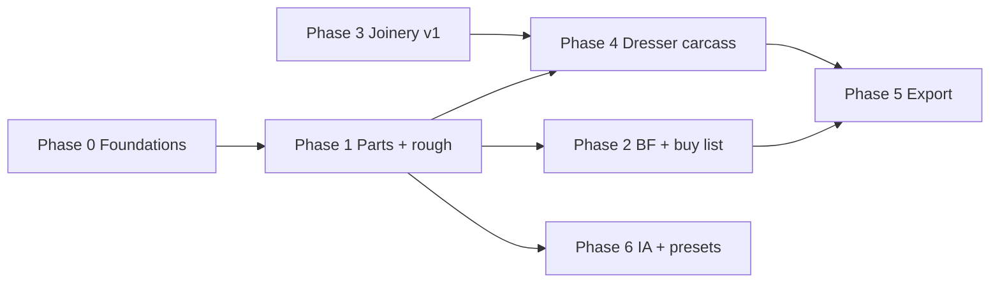

# Implementation plan — Workshop Companion / Grainline

This plan turns `docs/PRD.md` into **sequenced engineering work** on the existing Next.js app. Each phase ends with something **shippable and testable**.

## Current baseline (repo)

- `components/GrainlineApp.tsx` — preset shell (dresser, board cuts, placeholders)  
- `lib/dresser-engine.ts` + `components/DresserPlanner.tsx` — case grid, openings, drawer box sizes, back-solve height  
- `lib/optimize-cuts.ts` + `components/CutPlanner.tsx` — 1D stick packing, kerf, max carry  
- `lib/imperial.ts` — parse/format imperial (¼″ display bias)  

**Gaps vs PRD (historical note):** this section reflected the pre-implementation baseline. Most listed gaps are now implemented; treat remaining unchecked or partial phase items as the active delta.

---

## Phase 0 — Foundations (1–2 days) ✅ Done

**Goal:** Shared types and navigation skeleton without breaking current presets.

| Task | Detail |
|------|--------|
| [x] P0.1 | Add `docs/` reference links in `README.md` (PRD + this plan). |
| [x] P0.2 | Introduce `lib/project-types.ts`: `Project`, `AssemblyId`, `Part`, `Dimension3`, `RoughSpec`, `MaterialSpec` (minimal fields). |
| [x] P0.3 | Add **client-side project state** (React context or lightweight store) scoped to `/` for now; persist optional `localStorage` key `grainline-project-v1`. |
| [x] P0.4 | Restructure UI into **layout regions**: left column “Project / inputs”, right column “Outputs” inside `GrainlineApp` or a new `components/ProjectWorkspace.tsx` (dresser + board cut nest as **modules**). |

**Exit criteria:** App still runs; dresser and board cut work; empty project state serializes.

---

## Phase 1 — Parts table + three-layer dimensions (3–5 days) ✅ Done

**Goal:** PRD’s **finished vs rough** distinction on real rows.

| Task | Detail |
|------|--------|
| [x] P1.1 | **Parts table** UI: add/edit rows (name, assembly, qty, finished T×W×L, material label, grain note, status). |
| [x] P1.2 | **Rough columns** auto-filled from `finished + millingAllowance` (per project default); per-part override. |
| [x] P1.3 | **Explain row**: tooltip or expandable “Calculation” showing formula (e.g. `rough = finished + 2 × allowance` on relevant axes). |
| [x] P1.4 | Wire **dresser results** → “Add drawer parts to table” (push box W×H×D as parts with assembly `Drawers`). |

**Exit criteria:** User can see finished and rough on same row; dresser output populates parts.

---

## Phase 2 — Board feet + buy list (3–5 days) ✅ Mostly done

**Goal:** PRD **material estimator** and **buy list** v1.

| Task | Detail |
|------|--------|
| [x] P2.1 | `lib/board-feet.ts` — BF/LF from exact rough dims + qty, while keeping **waste, transport cap, and nominal thickness wording** explicitly labeled as planning assumptions in UI/print copy. |
| [x] P2.2 | **Group parts** by `material + thicknessCategory` (user-selectable category: 4/4, 5/4, ½ ply, etc.). |
| [x] P2.3 | **Buy list panel**: total BF per group, **lineal feet** (Σ qty × rough L / 12) with same waste %, **suggested stick lengths** ≤ `maxTransportLength`. |
| [x] P2.4 | “**Rough stick layout**” = greedy pack of *rough L × qty* from parts list (kerf + stock ≤ transport). |

**Exit criteria:** For a populated project, user sees BF subtotals and a readable buy list with transport cap respected.

---

## Phase 3 — Joinery engine v1 (5–8 days)

**Goal:** One joint type at a time, **per-connection** parameters, visible deltas.

| Task | Detail |
|------|--------|
| [x] P3.1 | Data model: `ProjectJoint` on project + **rule id** + params + **before/after** finished dims (persisted). |
| [x] P3.2 | First rule: **groove + ¼″ back panel** — floating panel W/L deltas. |
| [x] P3.3 | Second rule: **mortise & tenon (simplified)** — rail +ΔL / stile −ΔL per tenon length (finished L; rough follows unless manual). |
| [x] P3.4 | UI: **Joinery** lists applied connections; expand for explanation + before/after T×W×L. |

**Exit criteria:** At least two rule types change part numbers with explicit explanation text.

---

## Phase 4 — Carcass generator for dresser (5–7 days)

**Goal:** PRD **guided builder**: derive **case parts** from dresser preset, not only openings.

| Task | Detail |
|------|--------|
| [x] P4.1 | `lib/dresser-carcass.ts` — sides, top, bottom, dividers, kick (rectangular prisms) from outer dims + thicknesses + column count. |
| [x] P4.2 | Push generated parts into parts table with assemblies `Case`, `Base`, etc. |
| [x] P4.3 | **Grain hints** on case parts (vertical sides/dividers, top/bottom W grain, kick, back panel note). |
| [x] P4.4 | Shelf dados not auto — documented in carcass header + grain notes. |

**Exit criteria:** One preset produces a **full parts list** (case + drawers) ready for BF grouping.

---

## Phase 5 — Export + print (2–4 days)

**Goal:** Shop-ready artifact.

| Task | Detail |
|------|--------|
| [x] P5.1 | **`/print` route** + print styles: finished + rough table, buy list (BF + lineal feet), assumptions. |
| [x] P5.2 | **CSV export** of parts table. |
| [x] P5.3 | **PDF:** user messaging — browser Print → Save as PDF (no server PDF dependency). |

**Exit criteria:** User can leave the shop with a single printed sheet.

---

## Phase 6 — IA split + new presets (ongoing)

**Goal:** Match PRD **information architecture**.

| Task | Detail |
|------|--------|
| [~] P6.1 | Tabs: **Setup | Build | Shop | About** (full PRD IA can split further later). |
| [x] P6.2 | **TV console** stub preset; standing cabinet placeholder. |

---

## Dependencies & ordering

**Recommended critical path:** P0 → P1 → P2 → P5 (usable “planner + buy + print”), then P3 → P4 for depth.

---

## Testing strategy (lightweight)

- **Unit tests** for `dresser-engine`, `optimize-cuts`, `imperial`, new `board-feet` and joinery pure functions.  
- **Fixtures:** one dresser project JSON in `fixtures/` for regression snapshots.  
- **Manual:** print preview + CSV open in Numbers/Excel.

---

## Review checkpoints

After **Phase 1** and **Phase 2**, pause for a **real project** (e.g. two-column six-drawer dresser): validate BF and buy list against hand calculation. Adjust waste defaults before building more joinery rules.
